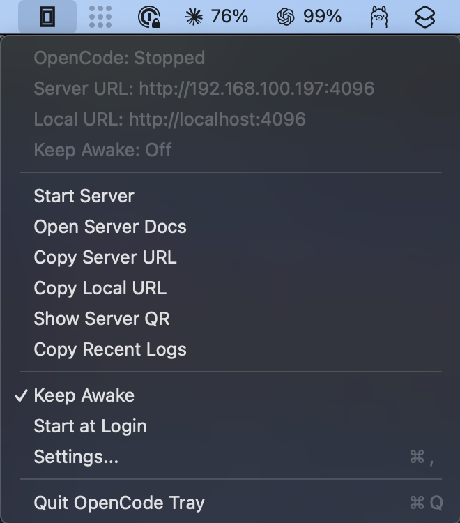
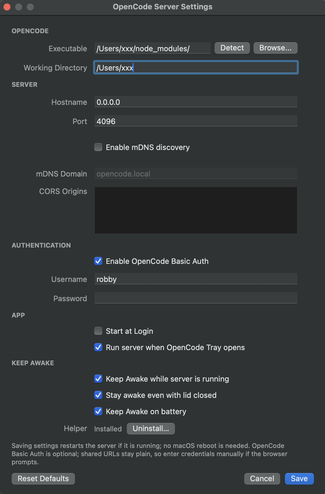

# OpenCode Tray

A small macOS menu bar app that runs `opencode serve` as a managed child process and surfaces the HTTP API to the rest of your devices.



OpenCode's CLI exposes an HTTP API through `opencode serve`. Running that in a terminal works, but the server dies with the terminal, port collisions silently fail, your Mac happily sleeps mid-request, and when you bring up Tailscale after the fact the URL you copied is wrong. OpenCode Tray treats `opencode serve` as a first-class menu-bar service: it starts at login, keeps the Mac awake only while the server is running, falls forward to the next free port on collisions, and updates the displayed URL whenever a network interface comes or goes. A QR code in the menu makes phone-onboarding one scan.

## Tutorial

Build the app bundle and open it:

```bash
sh scripts/build-app.sh
open dist/OpenCodeTray.app
```

Click the tray icon → **Settings…** → confirm the defaults → **Start Server**. To reach it from your phone, tap **Show Server QR** in the menu and scan.

## How-To

### Run from source

```bash
swift run OpenCodeTray
```

### Connect from a phone

1. Keep Hostname set to `0.0.0.0`.
2. Put the phone on the same network — Tailscale, WireGuard/VPN, or the same Wi-Fi LAN.
3. Tray → **Show Server QR**.

The QR uses the first reachable address it finds, preferring Tailscale → WireGuard → LAN. Bringing up a VPN *after* starting the server is fine — `opencode serve` binds to `0.0.0.0`, so the kernel accepts connections on new interfaces as they appear, and the tray's URL display refreshes live via `NWPathMonitor`.

### Use password auth

1. Settings → **OpenCode Basic Auth** → tick on.
2. Set Username and Password.
3. Use Copy Server URL / Show Server QR as normal; enter the credentials when the browser prompts.

Credentials are never embedded in shared URLs.

### Stop the Mac sleeping while the server runs

Settings → **Keep Awake** → tick **Keep Awake while server is running**.

The app holds an IOKit `PreventUserIdleSystemSleep` assertion only while opencode is up. The moment the server stops — manually, on crash, on quit — the assertion is released.

Two optional sub-toggles:
- **Stay awake even with lid closed** — adds a `PreventSystemSleep` assertion. macOS only honors this on AC power without further help (see next section).
- **Keep Awake on battery** — keep assertions active when running on battery too.

### Override lid-close-on-battery (full caffeinate)

macOS enforces lid-close-on-battery at the system level; the standard `PreventSystemSleep` assertion is ignored on battery. The workaround is `pmset -b disablesleep 1`, which needs root. OpenCode Tray ships a tiny privileged helper to do this on demand:

1. Settings → **Keep Awake** → **Install…** under "Helper".
2. macOS prompts for Touch ID / admin password (once).
3. The installer copies an ad-hoc-signed helper to `/usr/local/libexec/opencode-tray-helper`, drops a LaunchDaemon at `/Library/LaunchDaemons/ai.opencode.tray.helper.plist`, and bootstraps it.
4. Tick **Keep Awake on battery**.

From then on, when opencode is running on battery the helper sets `pmset -b disablesleep 1`; on server stop / app quit it sets it back to `0`. To remove: Settings → **Uninstall…**.

### Survive port collisions

If the configured port is already taken when you click Start Server, the tray scans forward up to 50 ports, picks the first free one, and uses that. The actual port is reflected everywhere — tray status, Server URL, Copy URL, QR, Open Docs — until the server stops. A log line records the substitution (Tray → **Copy Recent Logs**).

### Open docs / copy URL / copy logs

Tray menu items: **Open Server Docs**, **Copy Server URL**, **Copy Local URL**, **Copy Recent Logs**.

## Reference

### Tray menu

Status block (auto-refreshes on menu open and on network changes):
- **OpenCode:** Stopped / Starting / Running (pid) / Failed
- **Server URL:** the address QR/Copy uses
- **Local URL:** local-only URL (hidden if equal to Server URL)
- **Keep Awake:** Off / On / On (Lid OK) / On (Lid OK, Battery Forced) / Paused (on battery)

Actions:
- **Start Server / Stop Server**
- **Open Server Docs**, **Copy Server URL**, **Copy Local URL**, **Show Server QR**, **Copy Recent Logs**
- **Keep Awake** (quick toggle)
- **Start at Login** (quick toggle)
- **Settings…**
- **Quit**

### Defaults

- Executable: `opencode` (PATH + common install locations)
- Hostname: `0.0.0.0`
- Port: `4096` (auto-shifts to next free)
- Working directory: home directory
- mDNS: off, domain `opencode.local`
- CORS origins: none
- OpenCode Basic Auth: off
- Start server when tray opens: on
- Start at Login: off
- Keep Awake: off
- Helper: not installed

### URL preference order

For QR and Copy Server URL when Hostname is `0.0.0.0`:

1. Tailscale IP (`100.64.0.0/10` or interface name containing "tailscale")
2. WireGuard/VPN IP (private IPv4 on `utun*` / `wg*`)
3. LAN private IPv4 (`10.0.0.0/8`, `172.16.0.0/12`, `192.168.0.0/16`)
4. Fallback to `localhost`

### Executable resolution

`opencode` is resolved in order against: the Settings value, `PATH`, `~/.opencode/bin`, `~/.bun/bin`, `/opt/homebrew/bin`, `/usr/local/bin`. Settings has **Detect** and **Browse…** to pin a specific binary. Node/Bun shim wrappers are unwrapped to the native binary where possible.

### Helper paths

- Binary: `/usr/local/libexec/opencode-tray-helper`
- Plist: `/Library/LaunchDaemons/ai.opencode.tray.helper.plist`
- Mach service: `ai.opencode.tray.helper`

Install/uninstall is driven from Settings. Under the hood the Swift app writes a one-shot install script to `$TMPDIR` and runs it through `osascript ... with administrator privileges`.

### Persistence

- App settings: `~/Library/Preferences/ai.opencode.tray.plist`
- Launch-at-login: `~/Library/LaunchAgents/ai.opencode.tray.plist`

## Explanation

The tray runs `opencode serve` as a child `Process`, captures stdout + stderr into a 12 KB rolling buffer, and emits state changes via a single callback. Restart is `stop` + `start`; saving Settings triggers a restart automatically if the server is running.

URL resolution is recomputed on every menu open and on every `NWPathMonitor` update, so the displayed URL tracks the current network without needing a server restart. Because `opencode serve` binds to `0.0.0.0`, the kernel accepts traffic on all current *and future* IPv4 interfaces — a Tailscale or VPN tunnel coming up later requires no re-bind.

Keep Awake is a thin wrapper around `IOPMAssertionCreateWithName`. The setting is gated on the server's running state, so assertions are released the moment opencode exits.

The battery-override path uses a privileged helper rather than asking for sudo on every toggle. The helper is ad-hoc signed (no paid Apple Developer cert needed), installed once via `osascript ... with administrator privileges`, and runs as a LaunchDaemon. Communication is `NSXPCConnection` on the `ai.opencode.tray.helper` mach service. The helper's only privileged operation is `/usr/bin/pmset -b disablesleep <0|1>`.

---


